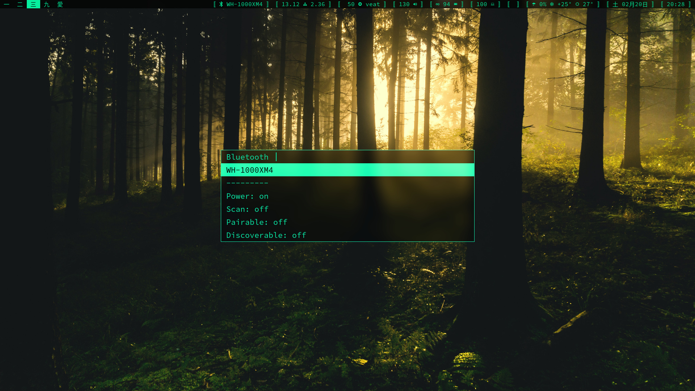

# dmenu
A dynamic menu for X developed on [suckless.org](https://tools.suckless.org/dmenu/). This is my heavily modified/patched fork of dmenu, it is kept up to date (to my best ability) with the latest changes on the [upstream](https://git.suckless.org/dmenu/).



## Features
Features that are shipped by default are not listed, those I believe to be worth mentioning are listed.

- Aesthetics: 
	- Transparency enabled through window compositor.
	- Centered window (`-c/-C` option to enable/disable).
	- Border (`-bw <border_width>` option).
	- Line height (`-h <height>` option).
	- Adjustable position and dimensions (`-x <xoffset> / -y <yoffset> / -z <width>`).
- Password input support (`-P` option to enable).
- Case insensitive matching (`-i/-I` option to enable/disable).
- Fuzzy matching (`-fz/Fz` option to enable/disable).


## Requirements
- In order to build dmenu you need the Xlib header files.
- Default font is "[SauceCodePro Nerd Font Mono](https://www.nerdfonts.com/)".


## Installation
Clone the repo and enter the `src` dir:

```shellscript
git clone https://github.com/sarrost/dmenu --depth 1
cd dmenu/src
```

Edit `config.mk` to match your local setup (you can usually leave this untouched and everything will work). dmenu is installed into the `/usr/local` namespace by default.

Afterwards enter the following command to build and install dmenu (if necessary as root, for example, with `sudo`):

```shellscript
make clean install
```


## Running dmenu
See the man page for details.


## Patches
- Alpha patch ([dmenu-alpha-20200618.diff](https://gist.github.com/oibind/d17b79025765f53e99716fb1ee780c88)).
- Center patch ([dmenu-center-20200111-8cd37e1.diff](https://tools.suckless.org/dmenu/patches/center/)).
- Border patch ([dmenu-borderoption-20200217-bf60a1e.diff ](https://tools.suckless.org/dmenu/patches/border/)).
	- Border is added on the outside, i.e if width is 800px and border width is 1px then with the border total width is 802px.
- Fuzzy match patch ([dmenu-fuzzymatch-4.9.diff](https://tools.suckless.org/dmenu/patches/fuzzymatch/)).
- Fuzzy highlight patch (disabled due to issues with transparency) ([dmenu-fuzzyhighlight-4.9.diff](https://tools.suckless.org/dmenu/patches/fuzzyhighlight/)).
	- Currently disabled, the colors don't seem to play well with transparency enabled.
- Case insensitive patch ([dmenu-caseinsensitive-5.0.diff](https://tools.suckless.org/dmenu/patches/case-insensitive/)).
- Line height patch ([dmenu-lineheight-5.0.diff](https://tools.suckless.org/dmenu/patches/line-height/)).
- Password patch ([dmenu-password-4.9.diff](https://tools.suckless.org/dmenu/patches/password/)).
- Xyz patch ([dmenu-xyw-5.0.diff](https://tools.suckless.org/dmenu/patches/xyw/)).
